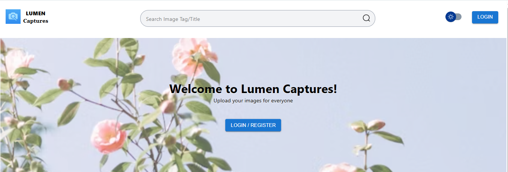
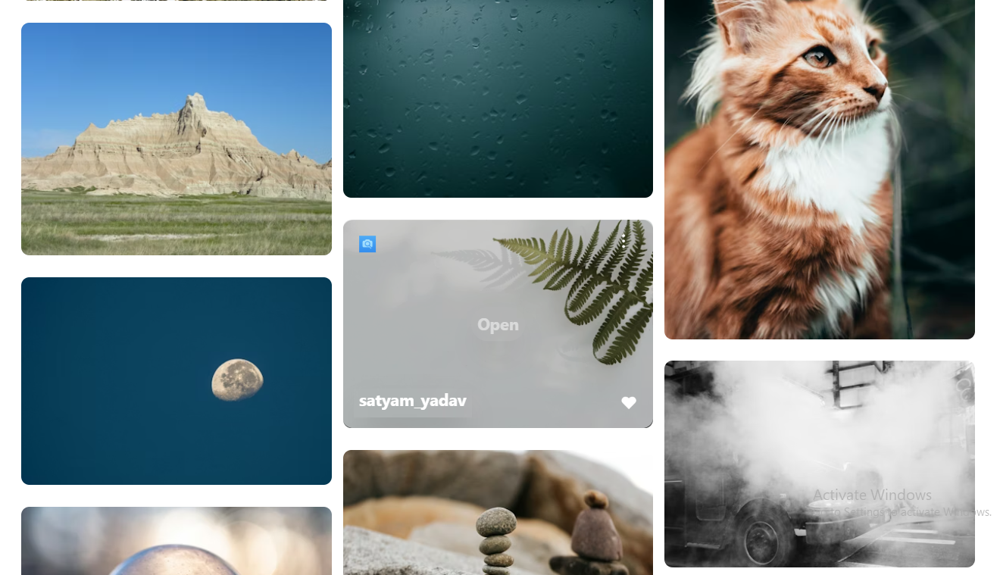
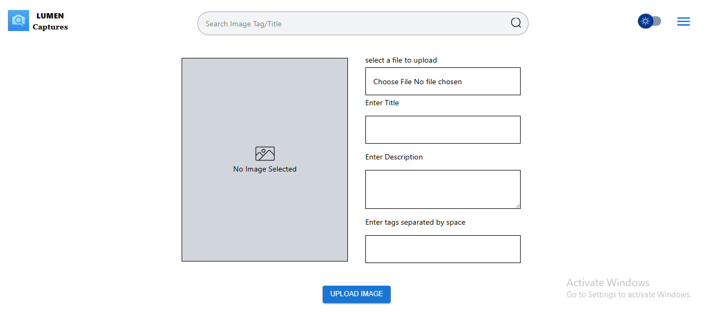

# Lumen Captures – Frontend

The frontend of **Lumen Captures** is a modern React Single Page Application (SPA) designed for performance, responsiveness, and secure session-based authentication.

It provides a smooth image exploration and portfolio experience powered by cursor-based pagination and cookie-based JWT authentication.

## 📸 Screenshots

### Home Page



### Image Layout Desktop



### Uploads



### Responsive UI + Dark Mode


## Project structure

Lumen-Frontend/  
│  
├── src/  
│ ├── components/  
│ ├── pages/  
│ ├── context/  
│ ├── hooks/  
│ ├── services/  
│ ├── utils/  
│ └── App.jsx  
│  
├── public/  
├── .env  
├── package.json  
└── README.md

## Setup Instruction

```bash
cd Lumen-Captures/Lumen-Frontend
npm install

# Configure environment variables
VITE_API_URL=<your-backend-url>
VITE_LICENSE_URL=<license-url>
VITE_OAUTH_URL=google/login

npm run dev

# app runs at
http://localhost:5173
```
